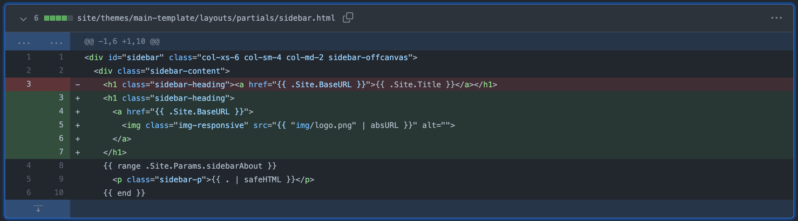
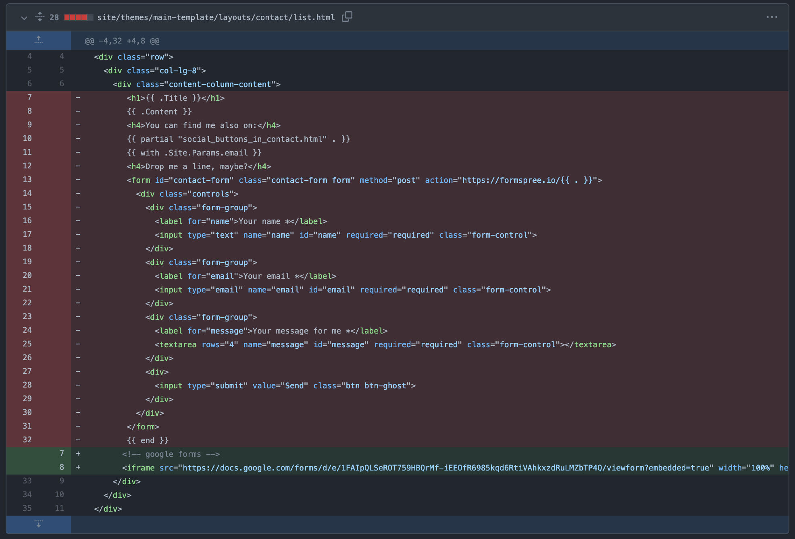
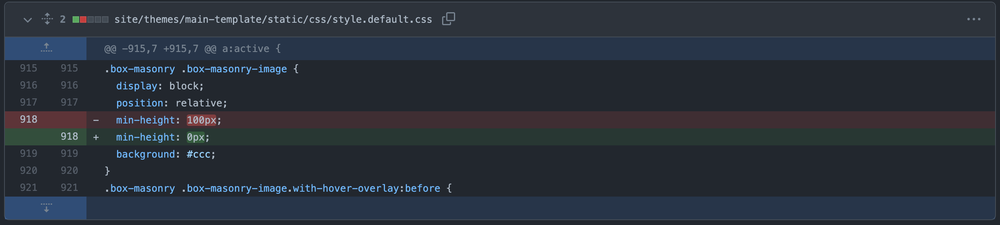
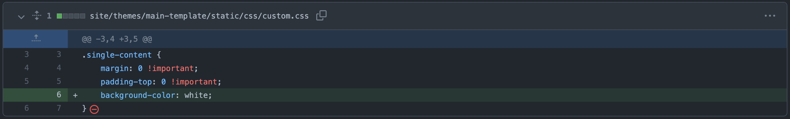
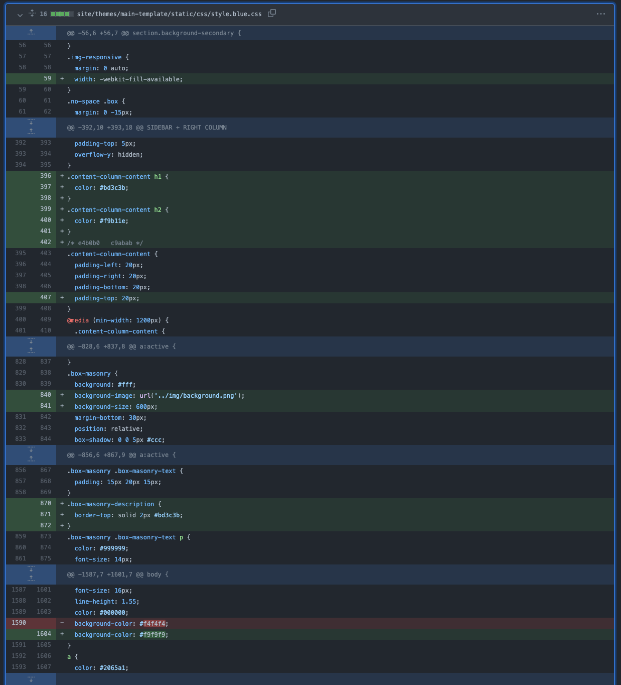

# Lenguaje de marcas

## Hugo

Hugo es un generador de contenidos estático, el cuál necesita de una estructura de archivos y una plantilla que la podemos descargar con la finalidad de generar el contenido deseado.

Gracias a Hugo el contenido será generado a partir de unos archivos Markdown dentro de la [carpeta content](../site/content).

##### [Mas información sobre Hugo](hugo_instructions.md)

## Plantilla

En este proyecto hemos utilizado una plantilla llamada [Creative Portfolio](https://github.com/kishaningithub/hugo-creative-portfolio-theme), diseñada por _Kishan B_.

Esta [plantilla/tema](../site/themes/main-template) tiene **HTML, en el que está organizado** en diferentes archivos _.html_ dentro de la [carpeta layouts](../site/themes/layouts).

### [_default](../site/themes/main-template/layouts/_default)
- **[baseof](../site/themes/main-template/layouts/_default/baseof.html)** : es el archivo principal, en el cual se encuentran <!--CAMBIO (está indicado) --> las etiquetas `html`, `head` y `body`. A partir de este archivo `.html` se irá insertando el contenido correspondiente dentro de la etiqueta `body`.
- **[list](../site/themes/main-template/layouts/_default/list.html)** : el archivo list será insertado en el `body` de _baseof_ siempre y cuando el apartado de la web que se está visualizando este listando el contenido, como podría ser _home_ o algún filtro respectivo a _home_.
- **[single](../site/themes/main-template/layouts/_default/single.html)** : archivo que será insertado en el `body` de _baseof_ cuando el apartado que se visualiza es contenido único. En este proyecto el _about_ se encuentra el aprtado de restaurante y un formulario<!-- Cambiar En nuestro caso podría ser un restaurante, _about_ y el formulario. -->

### [about](../site/themes/main-template/layouts/about)
- **[list](../site/themes/main-template/layouts/about/list.html)** : en este caso el creador de la plantilla a preferido que _about_ tenga un contenido diferente a los demas _singles_ .

### [contact](../site/themes/main-template/layouts/contact)
- **[list](../site/themes/main-template/layouts/contact/list.html)** : en este caso el creador de la plantilla a preferido que _contact_ tenga un contenido diferente a los demas _singles_. En nuestro caso hemos modificado esta parte del _HTML_ para retirar el formulario de contacto y poner el **formulario de ingreso de datos**.

### [partials](../site/themes/main-template/layouts/partials)
#### En partials podemos encontrar todas las particiones por separado para los diferentes apartados de la web, que pueden ser aplicados (de forma automágica por Hugo) en los diferentes _.html_ que hemos visto anteriormente.

- **[scripts](../site/themes/main-template/layouts/partials/scripts.html)**: este archivo contiene todas las etiquetas `script` que requiere la web para renderizar las animaciones, tales como _bootstrap_, _jQuery_, etc.
- **[sidebar](../site/themes/main-template/layouts/partials/sidebar.html)**: en este archivo esta indicado todo el _HTML_ que se renderiza como **barra de navegación lateral** y que será aplicado en todos los _HTML_ en los que este indicado el mismo.
- **[portfolio](../site/themes/main-template/layouts/partials/portfolio.html)**: este archivo es especificamente para los tipos _list_ descritos anteriormente en _\_default_, recoge todos los subapartados del directorio en el que se encuentra y genera una lista de cajas/botones en los que se puede hacer click para navegar entre los diferentes _singles_ del directorio.
- **[head](../site/themes/main-template/layouts/partials/head.html)** : en este archivo está indicado todas las etiquetas que deberán colocarse dentro de `head`, como por ejemplo el **título de la ventana** o el **css**.

## Modificaciones personales

- **[sidebar](https://github.com/Bruno-GD/mopygo/commit/ff42e3aea984d8e7be81a1d2fc5c0a76a8de4eba#diff-9a853331d35f96eacc0d081085d4d6f980d42a31ee6d742cdc5a40cd07b693aa)** : en este commit decidimos quitar el texto en la parte superior de la barra de navegación y poner un logo inventando para la web.

- **[contact](https://github.com/Bruno-GD/mopygo/commit/ff42e3aea984d8e7be81a1d2fc5c0a76a8de4eba#diff-832d051063b3f5ad9aab85bab80ef15e73ac5b9fcd0b5c0e7c86937e80c4d0b6)** : en este commit modificamos el formulario de contacto y lo reemplazamos por el formulario de _Google Forms_ incrustado con `iframe`.

- **[default.css](https://github.com/Bruno-GD/mopygo/commit/31635f947c85fe03d21b4fd5fd8b00d48aea9f57)** : en este commit modificamos una propiedad de las imagenes que se visualizan en las _lists_ de _singles_ ya que tenían un tamaño mínimo que no nos interesaba.

- **[custom.css](https://github.com/Bruno-GD/mopygo/commit/3cad31eb467cf7d1bca70ff2fe1b3702f5719f0c)** : en este commit añadimos un _css_ personalizado para los _singles_ ya que queríamos que la foto que se mostraba no tuviera márgenes o relleno y que el fondo fuera blanco.

- **[blue.css](https://github.com/Bruno-GD/mopygo/commit/ff42e3aea984d8e7be81a1d2fc5c0a76a8de4eba#diff-63465a32003ef9fddfdec73c215227eef1f99b6547ec549d29e263fbcb55fc9d)** : en este commit modificamos el como se visualizaban las "cajas" generadas en los _lists_, les añadimos un borde gris que separaba el texto del título, una imagen de fondo representativo y ciertos detalles de colores de fondo como otros tonos de grises.

##### _Dentro de los commits (de los enlaces de modifiaciones personales) hay más ejemplos_