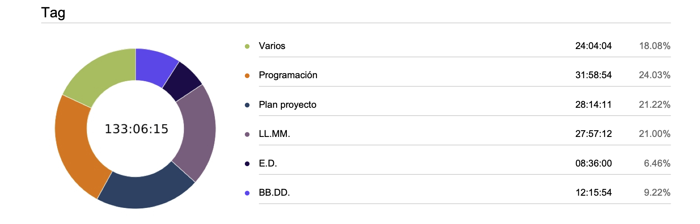

# Índice:
- [Introducción](#Introducción)
- [Arquitectura de la aplicación](#Arquitectura_de_la_aplicación)
- [Tecnologías utilizadas](#Tecnologías_utilizadas)
- [Diagrama de componentes](#Diagrama_de_componentes)
- [Estructura de base de datos](#Estructura_de_base_de_datos)
- [Diagrama de tiempo del proyecto](#Diagrama_de_tiempo_del_proyecto)

# Introducción

En este proyecto tendremos que actualizar una web de una empresa de menús de restaurantes de lujo. La página web contiene listas de cartas de restaurantes (ítems) que están en stock, en las cuales estas se clasifican en diferentes estilos de cocina.

El objetivo es implementar un sistema de integración y entrega continua (CI/CD), y a través de Python se desarrollará una aplicación para poder extraer los datos de MongoAtlas.

Por otra parte, se tranformará los documentos JSON a un ficheros Markdown a través de una aplicación de Python. A continuación esos ficheros se tienen que meter en una estructura de directorio que establece el generador de sitios estáticos llamado "Hugo" a través de otra aplicación de Python. "Hugo" leerá los ficheros Markdown y los transformará en documentos HTML que previamente los usaremos para la "nueva web". Finalmente se creará el CSS.

EL objetivo de este proyecto es facilitar al comprador y cada vez que se añade, se actualice o se elimine ítem de la base de datos de forma automática con la nueva información actualizada sin necesidad de acceder al Wordpress.

Requisitos:

- El sistema se tiene que desplegar de manera automática mediante Docker.
- Incrementar un sistema workflow en git.
- Aplicar el método SOLID.
- Documentar el manual técnico que describe la arquitectura de la aplicación.


# Arquitectura de la aplicación


# Tecnologías utilizadas
Las tecnologías utilizadas en MOPYGO son las siguientes:

### GoHugo

**GoHugo** es un framework para creación de sitios web de propósito general, además de ser generadores de sitios 
estáticos. 

### Mongodb

El **Mongodb** es un sistema de base de datos NoSQL, orientado a documentos y de código abierto

# Herramientas utilizadas
Las herramientas utilizadas en MOPYGO son las siguientes:

### VsCode

El **VsCode** es un editor de código fuente (IDE) utilizado para desarrollar el código fuente. El cual podemos 
usar las herramientas como conventional commits, live Share, git graph, Python.

### Git

El **Git** es un software de control de versiones. En nuestro caso hemos utilizado Git como sistema de versionado
de código para compartir y trabajar sobre nuestra aplicación y para mantener un registro de los cambios realizados.

### Clockify

El **Clockify** es una aplicación simple de seguimiento del tiempo y planilla de horarios que permiten tanto 
al usuario como a un equipo de trabajo realizar el seguimiento de las horas trabajadas en los proyectos. 

### GitHub

El **GitHub** es una forja para alojar proyectos utilizando el sistema de control de versiones Git. Lo hemos
utilizado esta plataforma para almacenar nuestro proyecto en la nube y además hemos utilizado la rama de github
pages para hostear nuestra web en la red.


# Diagrama de componentes


# Estructura de base de datos

Cada colección es un tipo de restaurante, dentro de ella está la lista de los restaurantes.
En cada documento sigue una estructura con los datos del restaurante como por ejemplo el nombre del
restaurante, la ubicación, la capacidad del local.

```json
{
  $jsonSchema: {
    bsonType: 'object',
    required: [
      'name',
      'location',
      'price',
      'menu',
      'capacity'
    ],
    properties: {
      name: {
        bsonType: 'string'
      },
      location: {
        bsonType: 'string'
      },
      price: {
        bsonType: 'int'
      },
      capacity: {
        bsonType: 'int'
      },
      menu: {
        bsonType: 'array',
        items: {
          additionalProperties: false,
		  required: [
            'menuName',
            'first',
            'second',
            'desert'
          ],
          properties: {
            menuName: {
              bsonType: 'string'
            },
            first: {
              bsonType: 'string'
            },
            second: {
              bsonType: 'string'
            },
            desert: {
              bsonType: 'string'
            }
          }
        }
      }
    }
  }
}

```
###### _Estructura de la base de datos utilizada en el proyecto_


# Diagrama del tiempo del proyecto 



 

<!-- # Conclusiones.
a. Posibles mejoras.

- Mejorar y aplicar la página web. 
- Volver a refactorizar el código.
- Cambiar el tipo de formulario a uno de html


b. Principales dificultades encontradas.

- No sabíamos la tecnología Hugo y hemos tenido que invertir más horas de las que pensábamos.
- A medida que se iba acercando la hora de entregar el proyecto se iba incrementando más información que al.
- El tiempo a sido muy justo por la magnitud del proyecto.
- Hugo dejo de funcionar de repente. 
