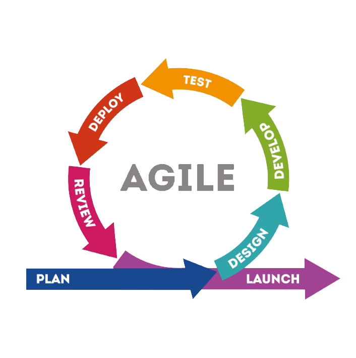
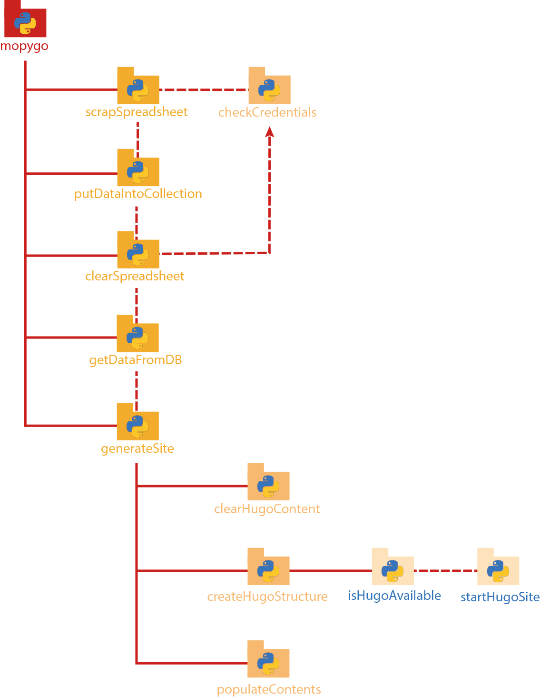

# Índice
- [Introducción](#Introducción)
- [Metodología](#Metodología) 
- [Análisis](#Análisis)
  - [Primer diagrama general](#Primer-diagrama-general)
  - [Posibles tecnologías](#Posibles-tecnologías)
- [Diseño](#Diseño)
  - [Diagrama de componentes](#Diagrama-de-componentes)
  - [Esquema BBDD](#Esquema-BBDD)
- [Implementación](#Implementación)
  - [Tecnologias utilizadas](#Tecnologias-utilizadas)
  - [Herramientas utilizadas](#Herramientas-utilizadas)
  - [BackEnd](#BackEnd)
    - [CRUD](#CRUD:)
  - [FrondEnd](#FrondEnd)
- [Pruebas](#Pruebas)
  - [TDD](#TDD)
  - [CRUD](#CRUD)
- [Comparación temporal](#Comparación-temporal)
- [Dificultades](#Dificultades)
- [Futuras mejoras](#Futuras-mejoras)
- [Bibliografía](#Bibliografía)


# Introducción

En este proyecto tendremos que actualizar una web de una empresa de menús de restaurantes de lujo. La página web contiene listas de cartas de restaurantes (ítems) que están en stock, en las cuales estas se clasifican en diferentes estilos de cocina.

El objetivo es implementar un sistema de integración y entrega continua (CI/CD), y a través de Python se desarrollará una aplicación para poder extraer los datos de MongoAtlas.

Por otra parte, se tranformará los documentos JSON a un ficheros Markdown a través de una aplicación de Python. A continuación, esos ficheros se tienen que meter en una estructura de directorio que establece el generador de sitios estáticos llamado "Hugo" a través de otra aplicación de Python. "Hugo" leerá los ficheros Markdown y los transformará en documentos HTML que previamente los usaremos para la "nueva web". Finalmnte, se creará el CSS.

EL objetivo de este proyecto es facilitar al comprador y cada vez que se añade, se actualice o se elimine ítem de la base de datos de forma automática con la nueva información actualizada sin necesidad de acceder al Wordpress.

Requisitos: 
- El sistema se tiene que desplegar de manera automática mediante Docker.
- Incrementar un sistema _workflow_ en git.
- Aplicar el método SOLID.
- Documentar el manual técnico que describe la arquitectura de la aplicación. 

# Metodología

Desarrollo iterativo y creciente (o incremental) es un proceso de desarrollo de software creado en respuesta a las debilidades del modelo tradicional de cascada.

Básicamente este modelo de desarrollo, que no es más que un conjunto de tareas agrupadas en pequeñas etapas repetitivas (iteraciones), es uno de los más utilizados en los últimos tiempos ya que, como se relaciona con novedosas estrategias de desarrollo de software y una programación extrema, es empleado en metodologías diversas.

El modelo consta de diversas etapas de desarrollo en cada incremento, las cuales inician con el análisis y finalizan con la instauración y aprobación del sistema.

El modelo incremental lleva a pensar en un desarrollo modular, con entregas
parciales del producto Software denominados "incrementos" del sistema, que son escogidos en base a prioridades predefinidas de algún modo.

El modelo permite una implementación con refinamientos sucesivos (ampliación y/o mejoras). Con cada incremento se agrega nueva funcionalidad o se cubren nuevos requisitos o bien se mejora la versión previamente implementada del producto software.


En definitiva, este modelo es más flexible y rápido de usar. Además de reducir las propiedades de riesgo por lo que reduce tanto el coste de producción como el tiempo de creación. También es más fácil de probar y de depurar en una iteración más pequeña eso nos facilita detectar errores en porciones más pequeñas del código. Gracias a esto le permite al usuario utilizar el sistema antes de su puesta en producción ya que todas las piezas del mismo han sido probadas y funcionan.

No obstante, hay que tener en cuenta que se requiere una cierta experiencia y que las fases de iteraciones no se superponen por lo que no podemos reutilizar iteraciones, creando así un aumento considerable del código. Así mismo hay que considerar que este método puede ocasionar problemas de la arquitectura.

En conclusión, dependiendo de la finalidad de cada proyecto nos puede beneficiar este método ya que es más rápido, flexible y no hay que olvidar que reduce el coste de producción.


Además, nos hemos apoyado con el scrum. En ella se basa en la teoría de control de procesos empírica o empirismo. El empirismo asegura que el conocimiento procede de la experiencia y de tomar decisiones basándose en lo que se conoce. Scrum emplea un enfoque iterativo e incremental para optimizar la predictibilidad y el control del riesgo. Los aspectos significativos del proceso deben ser visibles para aquellos que son responsables del resultado. La transparencia requiere que dichos aspectos sean definidos por un estándar común, de tal modo que los observadores compartan un entendimiento común de lo que se está viendo.

Esta metodología está formada por 5 etapas que son:
1. Inicio
2. Planificación y estimación
3. Implementación
4. Revisión y retrospectiva
5. Lanzamiento



Para finalizar podemos decir que Scrum es una metodología ágil que hace énfasis en el trabajo en equipo donde la claridad de los objetivos es crucial para avanzar hacia una versión cada vez mejor. Desde el punto de vista humano, favorece la motivación, la creatividad y el compromiso del equipo de trabajo. La claridad de los objetivos de cada una de las tareas programadas, así como el registro diario de las novedades, son factores que generan propuestas de avance hacia una versión mejorada. Estos factores, por supuesto, se reflejan positivamente en los niveles de producción de la empresa. Sin embargo, el scrum no es muy efectivo si se hacen con grupos muy ampliados ya que se puede ir de las manos y tardar más de lo necesario. A eso, también, hay que añadirle que se tiene que trabajar con metas por días o semanales o mensuales y por etapas para poder llegar a los plazos y eso se necesita mucha organización. Asimismo, es importante que las personas que hagan esta metodología tengan un gran nivel de cualificación para poder realizarla correctamente. En definitiva, el scrum si se hace bien es muy efectivo pero requiere un alto nivel de implicación.

# Análisis

## Primer diagrama general

Partimos de la base en la que hay un servidor. En ella esta constituida por una capa de datos, que en nuestro caso hemos usado el servicio de Mongo Atlas, la cual tuvimos que poblar con datos de ejemplo. Dentro del mismo servidor con ayuda de un script de Python nos conectamos a la base de datos con la libreria _PyMongo_. 

Une vez sacado los datos entramos en la capa de negocio, la que encontramos otro script de Python que procesará los datos y escribirá archivos Markdown. 

AL finalizar la escritura de los archivos Markdown, Hugo consumirá esos archivos para generar el sitio web. 

Finalmente entramos en el entorno cliente donde encontramos una capa de presentación la cual está constituida por archivos HTML, CSS y JS (JavaScript). Gracias a ello el usuario final puede visualizar el contenido en su navegador 


## Posibles tecnologías

| Tecnologías | _workflow_ | BBDD | Generador web con MD |
|-| - | - | - |
| GoHugo | - | - | ✅ |  
| MongoDB |  - | ✅ | - |
| GitHub | ✅ | - | - |

# Diseño

## Diagrama de componentes



Este proyecto se compone de un archivo principal llamado _mopygo_. En este se accede a múltiples funciones que son llamadas a cada una de ellas (`scrapSpreadsheet`, `putDataIntoCollection`, `clearSpreadsheet`, `getDataFromDB`, `generateSite`).

La función `scrapSpreadsheet` recoge los datos escritos en un Excel de Google Drive el cual llama al procedimiento `checkCredentials` que comprueba que las credenciales de google son validas. 

La función `putDataIntoCollection` mete los datos en l base de datos. 

El procedimiento `clearSpreadsheet`limpa el Excel y accede al procedimiento `checkCredentials` que comprueba que las credenciales de google son validas.

La función `getDataFromDB`saca los datos de la base de datos. 

El procedimiento `generateSite` genera los Markdown para Hugo haciendo uso de tres procedimientos llamados `clearHugoContent`(limpiar la carpeta de contenido Hugo), `createHugoStructure`(crea la estructura de directorio de Hugo, para ello, comprueba si existe el comando de Hugo (`isHugoAvailable`) y en el caso que exista lo ejecuta (`startHugoSite`)) y  `populateContents`(puebla la carpeta de contenido con archivos Markdown).

# Esquema BBDD

El esquema de la base de datos es organizado de la siguiente forma, cada colección es un tipo de restaurante, dentro de ella está las listas de los restaurantes. En cada documento sigue una estructura con los datos del restaurante como por ejemplo el nombre del restaurante, la ubicación, la capacidad del local.

También tenemos una colección llamada `types` la cual contiene el nombre y la descripción del tipo de restaurante, el nombre hace referencia a una colección existente.

###### Validación esquema
```js
{
  $jsonSchema: {
    bsonType: 'object',
    required: [
      'name',
      'location',
      'price',
      'menu',
      'capacity'
    ],
    properties: {
      name: {
        bsonType: 'string'
      },
      location: {
        bsonType: 'string'
      },
      price: {
        bsonType: 'int'
      },
      capacity: {
        bsonType: 'int'
      },
      menu: {
        bsonType: 'array',
        items: {
          additionalProperties: false,
		  required: [
            'menuName',
            'first',
            'second',
            'desert'
          ],
          properties: {
            menuName: {
              bsonType: 'string'
            },
            first: {
              bsonType: 'string'
            },
            second: {
              bsonType: 'string'
            },
            desert: {
              bsonType: 'string'
            }
          }
        }
      }
    }
  }
}

```

 # Implementación
## Tecnologías utilizadas

Las tecnologías utilizadas en MOPYGO son las siguientes:
### **GoHugo**

**GoHugo** es un framework para creación de sitios web de propósito general, además de ser generadores de sitios 
estáticos. 

### **MongoDB**

El **MongoDB** es un sistema de base de datos NoSQL, orientado a documentos y de código abierto.

### **GitHub**

El **GitHub** es una forja para alojar proyectos utilizando el sistema de control de versiones Git. Lo hemos
utilizado esta plataforma para almacenar nuestro proyecto en la nube y además hemos utilizado la rama de github
pages para hostear nuestra web en la red.

### **Python**

Python es un lenguaje de programación interpretado cuya filosofía hace hincapié en la legibilidad de su código.​ Se trata de un lenguaje de programación multiparadigma, ya que soporta parcialmente la orientación a objetos, programación imperativa y, en menor medida, programación funcional.

## **Herramientas utilizadas**
Las herramientas utilizadas en MOPYGO son las siguientes:

### **VsCode**

El **VsCode** es un editor de código fuente (IDE) utilizado para desarrollar el código fuente. El cual podemos 
usar las herramientas como conventional commits, live Share, git graph, Python.

### **Clockify**

El **Clockify** es una aplicación simple de seguimiento del tiempo y planilla de horarios que permiten tanto 
al usuario como a un equipo de trabajo a realizar el seguimiento de las horas trabajadas en los proyectos. 

### **Git**

El **Git** es un software de control de versiones. En nuestro caso hemos utilizado Git como sistema de versionado
de código para compartir y trabajar sobre nuestra aplicación y para mantener un registro de los cambios realizados.

### **Black** 
_Black_ es un formateador obstinado que cumple con los requisitos impuestos en [PEP 8](https://www.python.org/dev/peps/pep-0008/). _Black_ reformatea archivos completos en su lugar. Las opciones de configuración de estilo están deliberadamente limitadas y rara vez se agregan. No tiene en cuenta el formato anterior.

### **Coverage** 
_Coverage_ es una herramienta para medir la cobertura de código de los programas Python. Supervisa su programa, observa qué partes del código se han ejecutado, luego analiza la fuente para identificar el código que podría haberse ejecutado, pero no lo ha sido.

La medición de cobertura se usa generalmente para medir la efectividad de las pruebas. Puede mostrar qué partes de su código están siendo ejercitadas por pruebas y cuáles no.
## BackEnd

El backEnd son todas las tecnologías que se encuentran en la cara oculta al usuario, el servidor.

### [MongoAtlas](#MongoDB)
Para este proyecto hemos utilizado _MongoAtlas_, que es un servicio en la nube para gestionar bases de datos con la tecnología MongoDB, el cual ha sido impuesto por el _product manager_ del proyecto. Este sistema de base de datos se ha utilizado para poder almacenar todos los datos que deberán ser procesados y mostrados en el _site_ generado por _Hugo_.
### [Python](#Python)
El principal lenguaje de programación utilizado en este proyecto ha sido _Python_, impuesto por el _product manager_, ya que es un lenguaje multiplataforma y muy flexible a la hora de crear proyectos sencillos, además de permitir una gran escalabilidad. En nuestro caso hemos utilizado este lenguaje para realizar las consultas a _MongoAtlas_ y procesar los datos para convertirlos en contenido visual para el _site_ generado más adelante por _Hugo_, esto también nos permite automatizar la tarea con tecnologías como _Docker_ y _Kubernetes_.
### [Hugo](#GoHugo)
_Hugo_ ha sido nuestra principal herramienta para generar el contenido del _site_ en HTML, CSS y JS. Este también impuesto por el _product manager_, nos facilita el trabajo de convertir archivos _Markdown_ a un contenido que cualquier navegador podría mostrar y cualquier servidor web como _nginx_ o _Apache_ aceptaría estos archivos generados.


## FrontEnd
<!-- # explicación de que hemos hecho de cada uno -->
Todas las tecnologías que se encuentran a la vista del usuario, el cliente:
### Bootstrap
**Bootstrap** es una biblioteca multiplataforma o conjunto de herramientas de código abierto para diseño de sitios y aplicaciones web.

En nuestro caso ha sido utilizado para que la plantilla, y la web, tengan un contenido _responsive_ (que sea compatible con todos los dispositivos) y facilitar el trabajo de diseño de interfaz.
### jQuery
**jQuery** es una biblioteca multiplataforma de JavaScript, que permite simplificar la manera de interactuar con los documentos HTML, manipular el árbol DOM, manejar eventos, desarrollar animaciones y agregar interacción con la técnica AJAX a páginas web.​

Para este proyecto ha sido utilizado junto con _Bootstrap_ para añadir ciertas animaciones a la hora de visualizar el sitio y tener un diseño más moderno y actual.
### owl.js
**Owl Carousel** es un plugin adicional para _jQuery_ que permite crear colecciones de imágenes con un diseño moderno y animado.
### masonry.js
**Masonry** es una librería JavaScript para crear rejillas en el sitio web, de forma óptima coloca elementos en el espacio vertical disponible, como si de un muro de piedras se tratase.
<!-- explicación de que hemos hecho -->
# Pruebas
## TDD
### [Caso test introducción de datos](../test/test_db_data.py)
En este caso test haciamos las pruebas de inserción de datos de forma manual en la base de datos y con el uso de [mocks](../mocks).

En el [primer test](../test/test_db_data.py#L17-L43), se puede observar el uso de la función `putDataIntoCollection` la cual se conecta a la base de datos y introduce los datos en una colección.

En el [segundo test](../test/test_db_data.py#L47-L77), realizamos primero la recolección de los datos extraídos de los archivos _JSON_ guardados en la carpeta _mocks_ y son introducidos en la base de datos con el uso de la función anterior `putDataIntoCollection`.


### [Caso test conexión BBDD](../test/test_db_connection.py)
En este caso test intentamos conectarnos a la base de datos con el uso de un URI obtenido de _MongoAtlas_.

En el [primer test](../test/test_db_connection.py#L8-L12), con el uso de la función `getDataFromDB` intentamos conectarnos a la BBDD y obtener los datos de las colecciones.

En el [segundo test](../test/test_db_connection.py#L16-L24), usando la función ya mencionada intentamos conectarnos a la BBDD usando un URI inválido y así comprobar que la función procede como debería.


### [Caso test creación estructura Hugo](../test/test_create_structure.py)
En este caso test ejecutamos la función `createHugoStructure` para crear la estructura de directorios que establecía la documentación de _Hugo_.

En el [primer test](../test/test_create_structure.py#L13-L15), hacemos uso de la función mencionada para crear la estructura, primero se comprueba si está disponible el comando de _Hugo_ en la terminal del sistema y se ejecuta el comando correspondiente para generar una estructura nueva. En su defecto, el script de _Python_ genera una estructura básica.

En el [segundo test](../test/test_create_structure.py#L25-L27), como en el anterior caso test dejamos decidir comprobar la existencia del comando, en este hacemos comprobaciones con la función que ejecuta el comando de _Hugo_ evitando la comprobación anterior y forzando la ejecución del comando.

### [Caso test generar site](../test/test_generate_site.py)
En este caso test ejecutaremos la función `generateSite` que nos permitirá generar todo el contenido para _Hugo_ poder consumirlo más adelante.

En el [primer test](../test/test_generate_site.py#L7), ejecutamos la función pasandole datos de ejemplo y comprobar que no da ninguna excepción no controlada.

En el [segundo test](../test/test_generate_site.py#L9), obtenemos primero los datos de la BBDD y le pasamos datos "reales" a nuestra función para comprobar que no da ninguna excepción no controlada.

### [Caso test scrapper excel](../test/test_ss_scrapper.py)
En este caso test haremos uso de la función `scrapSpreadsheet` que nos permitirá obtener de _Google Spreadsheet_ los datos en un rango especificado.

En el [único test](../test/test_ss_scrapper.py#L12-L16), ejecutamos la función para extraer los datos del _Google Spreadsheet_ con el uso de las APIs de Google. Esta función recoge las credenciales de acceso y le indicamos un ID de hoja (generado por Google) y el rango (establecido por nosotros) que queremos capturar.
En este test queremos comprobar que la conexión a la API y el rango funciona como es debido y no hay ninguna excepción no controlada, además mostraremos por la salida de consola los datos del Excel.

## CRUD

Para hacer CRUD usaremos los siguientes datos que encontramos a continuación. 

```js 
{
    "name": "Regina Caterers",
    "location": "11 Avenue",
    "price": 455,
    "menu": [{
        "menuName": "Uep,com anam!",
        "first": "Patatas con chedar y beicon",
        "second": "sandwich con pollo y lechuga",
        "desert": "Tarta de manzana"
    }, {
        "menuName": "A la mierda la dieta",
        "first": "Hot Dog",
        "second": "Chuleton de 15kg",
        "desert": "Tarta tres chocolates"
    }],
    "capacity": 2,
    "image": "americanoPollo.jpeg"
}
```
### Validadión de esquema

1. Buscaremos la colección para comprobar que no existen esos datos.
```
db.american.find({name:"Regina Caterers"})
```


2. Insertar un docuemento con los datos de ejemplo con un `insertOne`.
```
db.american.insertOne({name:"Regina Caterers", ...})
```


3. Comprobar que se ha insertado el documento.
```
db.american.find({name:"Regina Caterers"})
```


4. Actualizar el documento.
```
db.american.update({name:"Regina Caterers"}, {$set: {price:400}})
```


5. Comprobar que el documento se han actuailzado.  
```
db.american.find({name:"Regina Caterers"})
```


6. Borrar el documento.
```
db.american.deleteOne({name:"Regina Caterers"})
```


7. Comprobar que se ha eliminado el documento.
```
db.american.find({name:"Regina Caterers"})
```


### Mensaje de error:

1. Insertar docuemnto erroneo.
``` 
db.american.insertOne({name:"Regina Caterers", ...})
```


2. Actualizar el documento de forma erronea. 
```
db.american.update({name:"Regina Caterers"}, {$set: {price:"400"}})
```


# Comparación temporal 

<figure>
  
  <figcaption>
    <h6><i>Diagrama circular de las horas invertidas</i></h6>
  </figcaption>
</figure>


En este proyecto hemos invertido un total de 159 horas en el cual por ambas partes de las personas implicadas en el proyecto (Noeila y Bruno) han hecho las mismas horas mutuamente.

En el siguiente diagrama circular podemos observar las horas invertidas por etiqueta (módulos de clase), en él podemos observar que donde más horas se han invertido es en _Entornos de Desarrollo_ debido a la gran documentación que se ha solicitado.

La segunda etiqueta con más horas invertidas es _Programación_ como era de esperar, debido a que el proyecto se centraba principalmente en el aprendizaje de Python.

En tercer, lugar tenemos la etiqueta _Plan proyecto_ la cual hace referencia a las horas invertidas en cómo se llevaría acabo el proyecto.

Las demás etiquetas, como _Lenguajes de marcas_, _Varios_ y _Bases de datos_ tienen menos horas invertidas debido a su baja complejidad en cuanto al proyecto.

<figure>
  
  <figcaption>
    <h6><i>Resumen horas diarias del 18/11/21 a 19/12/21</i></h6>
  </figcaption>
</figure>

<figure>
  
  <figcaption>
    <h6><i>Grafico comparativo entre horas previstas y las horas realizadas</i></h6>
  </figcaption>
</figure>

| Etiqueta | Horas calculadas | Horas reales |
| - | - | - |
| BB.DD. | 10 | 12,15 |
| LL.MM. | 20 | 27,64 |
| Programación | 25 | 31,58 |
| E.D. | 20 | 34,36 |
| Plan proyecto | 24 | 28,14 |
| Varios | 0 | 24,04 |
| Total | 99 | 157,84 |

Como podemos ver en el gráfico de arriba (Grafico comparativo entre horas previstas y las horas realizadas) a rasgos generales estimamos una duración _Total_ de 99 horas para este proyecto la cual nos hemos sobrepasando unas 58h. 

Como podemos observar en _Base de datos_ la diferencia es poca, solo nos hemos sobrepasado de 2 horas en cambio en _Lenguaje de marcas_ nos hemos excedido de 7 aproximadamente. Respecto a _Programación_ nos hemos pasado de 6 horas y en el apartado _Plan proyecto_ solo nos hemos pasado de 4 horas.

Sin embargo, en _Entornos de desarrollo_ ni el apartado _Varios_ pensábamos que iba a demorar tanto la tarea haciendo que en entornos nos pasáramos de 34 horas aproximadamente y en varios de 24 horas por lo que no calculamos bien la magnitud del trabajo que se requería.
# Dificultades

Las principales dificultades que hemos tenido han sido las siguientes:

En primer, lugar al no conocer la tecnología de Hugo, por lo que nos hemos tenido que documentar bastante sobre el y saber que capacidades o que cosas puede llegar a hacer este framework. Por lo que tuvimos que invertir más horas de las programadas para poder llevar a cabo los requisitos para este proyecto. 

En segundo lugar, Hugo nos ha estado dando problemas sobretodo en los dispositivos Windows y no sabias del por que. Incluso llegamos a desinstalar, volver a instalarlo y no obtuvimos ninguna respuesta. Finalmente tuvimos que cambiar el servidor web que ofrece Hugo y a partir de allí ya lo podíamos visualizar.

En tercer lugar, a medida que el proyecto iba avanzando se iba incrementando el contenido hasta llegar al punto de que en el ultimo momento ha habido modificaciones y documentación que incrementar. 

Finalmente, el tiempo ha sido el detonante de este proyecto pues a medida que iba avanzando el proyecto veíamos que era más grande de lo que nos imaginábamos. Además, a eso hay que añadir que se añadían nuevas funcionalidades y modificaciones.

# Futuras mejoras

Una de las posibles mejoras que nos gustaría implementar en este proyecto debido a que no tuvimos el tiempo suficiente para invertirlo en ello sería mejorar y ampliar los apartados de la página web, como podría ser los formularios de ingreso de datos, de actualización de datos y de borrado de datos.

Actualmente solamente encontramos un formulario de ingreso de datos hecho con _Google Forms_ y nos gustaría retirarlo y sustituirlo por un formulario hecho por nosotros en HTML, además de implementar una _RestAPI_ con la que poder interaccionar con la base de datos.

# Bibliografía

[Documento repte vevops CI/CD](https://docs.google.com/document/d/1qA-qOmxmJfzvVzHCmmv_wPQ2p5U8GA0Xu0w9rMpxbSM/edit?usp=sharing)

Scrum:

- [Scrum de “Wikipedia”](https://es.wikipedia.org/wiki/Scrum_(desarrollo_de_software))
- [Metodolgia Scrum de “Softeng”](https://www.softeng.es/ca-es/empresa/metodologies-de-treball/metodologia-scrum.html)
- [Scrum de “Atlassian”](https://www.atlassian.com/es/agile/scrum)
- [Ventajas y desventajas Scrum de "Waredrew"](https://blog.wearedrew.co/ventajas-y-desventajas-de-la-metodologia-scrum)


Hugo:

- [Introducción de hugo](https://gohugo.io/getting-started/quick-start/)
